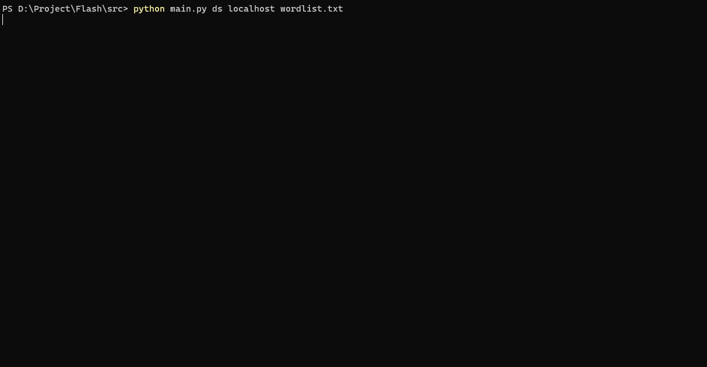

# Flash

<hr>

## Description
Flash is a Command-Line Hacking Tool written in Python Version 3. It includes <b>port scanning</b>, <b>directory scanning (gobuster-like)</b>, <b>Reverse Shells</b> and much more.

## Port Scanning
For Port Scanning, run the following command from the terminal:
```python3 src/main.py ps <IP> <PORT RANGE>```
Flash will start scanning all the ports in the given port range.
A port range is defined with a "-" in the middle.
Let's say you want to scan every port from 0-100 at localhost, this is how you would do it:
```python3 src/main.py ps localhost 0-100```

## Directory Scanning
For scanning directories of an IP/Website, run the following command from the terminal:
```python3 src/main.py ps <IP> <WORDLIST PATH>```
Flash will now enumerate the given IP/Website for the directories in the wordlist.
<b>It is important that the words in the wordlist file are seperated by a new line character (or just press "Enter" on your Keyboard!).</b>

## Demo

